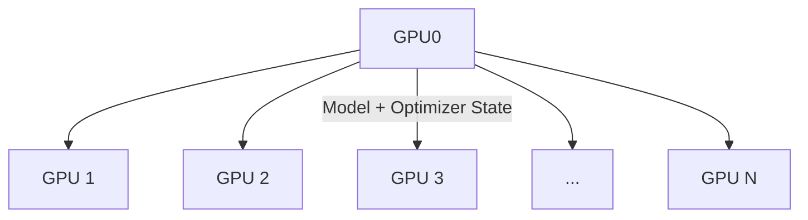
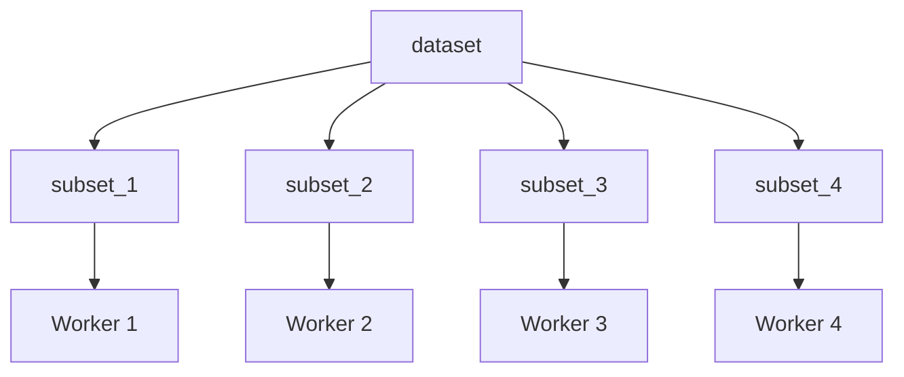
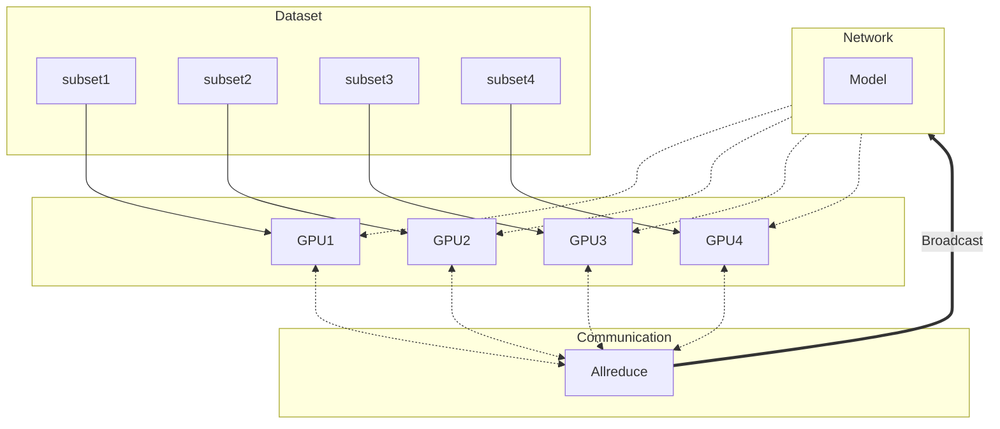

# Parallel Training Techniques
Sam Foreman
[<span class="orcid-green"></span>](https://orcid.org/0000-0002-9981-0876)
2024-03-09

# Parallel Training Techniques

<div>

</div>

# AI 🤝 Compute


<div class="dim-text" style="font-size: 0.55em;">

\[…\] since 2012, the amount of \[AI\] compute used has been increasing
exponentially with a \> 34-month doubling time[^1], or \[**300,000**x\].

</div>

# AI 🤝 Compute \[Modern Era\]


# Single GPU Training


# Collective Communication

Typically, we assign 1 `rank` to each GPU (or `accelerator`),
i.e. `rank` $\in$ `[0, 1, ..., WORLD_SIZE-1]`.

::: {.panel-tabset}

### `AllReduce`

- Perform *reductions* on data (e.g. `sum`, `min`, `max`) across ranks,
  send result back to everyone


### `Reduce`

- Perform a *reduction* on data across ranks, send to individual


### `Broadcast`

- `broadcast` (*send*) a tensor <code>$x$</code> from one rank to all
  ranks


### `AllGather`

- Gathers tensors from the whole group in a list.


### `Scatter`

- Scatters a list of tensors to the whole group


<!-- ### `ReduceScatter` -->
<!---->
<!-- - Reduces, then scatters a list of tensors to all processes in a group. -->
<!---->
<!-- ::: {#fig-reducescatter} -->
<!---->
<!-- {width="50%"} -->
<!---->
<!-- ::: -->
<!---->
<!-- ::: -->

# Collective Operations

> [!WARNING]
>
> ### ⌛ Timeouts
>
> - Collective operations have to be called for each `rank` to form a
>   complete collective operation.
>   - Failure to do so will result in other ranks waiting
>     **indefinitely**

# Why Distributed Training?

- Splitting data across workers $\longrightarrow$ larger batch size[^2]
  - \[`micro_batch_size = 1`\] $\times$ \[`N` GPUs\] $\rightarrow$
    \[<b><code>global_batch_size = N</code></b>\]
- Smooth loss landscape
- Improved gradient estimators
- Less iterations needed for same number of epochs
  - May need to train for more epochs if another change is not made
  - e.g. scaling learning rate
- See [Large Batch Training of Convolutional
  Networks](https://arxiv.org/abs/1708.03888)

# Recent Progress

| Year |  Author  | Batch Size | Processor  |         \# Processors         |               Time                | Accuracy |
|:----:|:--------:|:----------:|:----------:|:-----------------------------:|:---------------------------------:|:--------:|
| 2016 |    He    |    256     | Tesla P100 |               8               |              29 Hour              |  75.30%  |
| 2019 | Yamazaki |   81,920   | Tesla V100 | <span class="red">2048</span> | <span class="blue">1.2 Min</span> |  75.08%  |

<!-- |                                 |             Goyal et al.             |               8192               |                 Tesla P100                  |             Caffe 2             |               1 Hour               |                            76.3%         | -->
<!-- |                                 |             Smith et al.             |         8192 ->  16,384          |                full TPU pod                 |           TensorFlow            |              30 Mins               |                            76.1%         | -->
<!-- |                                 |             Akiba et al.             |              32,768              |              Tesla P100 x1024               |             Chainer             |              15 Mins               |                            74.9%         | -->
<!-- |                                 |              Jia et al.              |              65,536              |              Tesla P40  x2048               |           TensorFLow            |              6.6 Mins              |                            75.8%         | -->
<!-- |                                 |             Ying et al.              |              65,536              |                TPU v3 x1024                 |           TensorFlow            |              1.8 Mins              |                            75.2%         | -->
<!-- |                                 |            Mikami et al.             |              55,296              |              Tesla V100 x3456               |               NNL               |              2.0 Mins              |                           75.29%         | -->

# Data Parallel Training

<!-- ::: {layout="[40,-5, 50]" layout-valign="center" style="display: flex; align-items:flex-end;"} -->
<!---->
<!-- ::: {.col1} -->
<!---->
<!-- ::: -->

<!-- ::: -->

# Data Parallel Training

- 🔗 Links:
  - [PyTorch Distributed
    Overview](https://pytorch.org/tutorials/beginner/dist_overview.html)
  - [Distributed Data Parallel — PyTorch master
    documentation](https://pytorch.org/docs/master/notes/ddp.html)
  - [🤗 Efficient Training on Multiple
    GPUs](https://huggingface.co/docs/transformers/en/perf_train_gpu_many)
  - [Getting Started -
    DeepSpeed](https://www.deepspeed.ai/getting-started/)

# Data Parallel Training


# Data Parallel Training

<div>

</div>

# Data Parallel Training

<div>

</div>

# Data Parallel Training


# Deal with Data

- At each training step, we want to ensure that **each worker receives
  unique data**

- This can be done in one of two ways:

  1.  Manually partition data (ahead of time) and assign different
      sections to different workers
      1.  Each worker can only see their local portion of the data
  2.  From each worker, randomly select a mini-batch
      1.  Each worker can see the full dataset

  > [!WARNING]
  >
  > ### ⚠️ Warning
  >
  > Don’t forget your seed!
  >
  > When randomly selecting, it is important that each worker uses
  > different seeds to ensure they receive unique data

# Best Practices

- Use parallel IO whenever possible
  - Feed each rank from different files
  - Use MPI IO to have each rank read its own batch from a file
  - Use several ranks to read data, MPI to scatter to remaining ranks
    - Most practical in big *at-scale* training

  > [!IMPORTANT]
  >
  > ### Keeping things in Sync 🤝
  >
  > **Computation stalls during communication !!**
  >
  > Keeping the communication to computation ratio small is important
  > for effective scaling.
- Take advantage of data storage
  - Use [striping on
    lustre](https://wiki.lustre.org/Configuring_Lustre_File_Striping)
  - Use the right optimizations for Aurora, Polaris, etc.
- Preload data when possible
  - Offloading to a GPU frees CPU cycles for loading the next batch of
    data
    - **minimize IO latency this way**

# Broadcast Initial State

- At the start of training (or when loading from a checkpoint), we want
  all of our workers to be initialized consistently
  - **Broadcast** the model and optimizer states from `rank() == 0`
    worker



# Model Parallel Training

<div>

</div>

# Hands-On

- [Instructions](https://github.com/argonne-lcf/ai-science-training-series/blob/main/06_parallel_training/README.md)

  -  [`saforem2/wordplay` 🎮💬](https://saforem2.github.io/wordplay/)
    \[[web](https://saforem2.github.io/wordplay/)\]

# Thank you!

- Organizers

- ALCF Data Science & Operations

- Feel free to reach out! <split even >

  [<i class="fas fa-home"></i>](https://samforeman.me)
  [<i class="far fa-paper-plane"></i>](mailto:///foremans@anl.gov)
  [<i class="fab fa-twitter"></i>](https://www.twitter.com/saforem2)
  </split>

<div class="callout-info" icon="false" title="🙏 Acknowledgements">

This research used resources of the Argonne Leadership Computing
Facility, which is a DOE Office of Science User Facility supported under
Contract DE-AC02-06CH11357.

</div>

# Backups

## Forward Pass

- Each worker has identical copy of model[^3]
- **Global batch of data split across workers**
- Loss + Grads averaged across workers before updating parameters



## Organization



# Data Parallel Training

<div>

</div>

## Emergent Abilities

<div width="66%" style="text-align: center;">


[Emergent abilities of Large Language
Models](https://arxiv.org/abs/2206.07682) Yao et al. (2023)

</div>

## Training LLMs

<div>

</div>

## Life-Cycle of the LLM

<div>

</div>

## Forward Pass

<video data-autoplay src="https://huggingface.co/datasets/huggingface/documentation-images/resolve/main/blog/assisted-generation/gif_1_1080p.mov">
</video>

## Generating Text

<video data-autoplay src="https://huggingface.co/datasets/huggingface/documentation-images/resolve/main/blog/assisted-generation/gif_2_1080p.mov">
</video>

## Life-Cycle of the LLM: Pre-training


## Life-Cycle of the LLM: Fine-Tuning


## Assistant Models

<span class="preview-image"
style="text-align:center; margin-left:auto; margin-right: auto;"></span>

## [`saforem2/wordplay` 🎮💬](https://github.com/saforem2/wordplay)

<!-- - [ `saforem2/wordplay`](https://github.com/saforem2/wordplay) -->

- Fork of Andrej Karpathy’s `nanoGPT`


## [`saforem2/wordplay` 🎮💬](https://github.com/saforem2/wordplay)


## Install

``` bash
python3 -m pip install "git+https://github.com/saforem2/wordplay.git"
python3 -c 'import wordplay; print(wordplay.__file__)'
# ./wordplay/src/wordplay/__init__.py
```

## Dependencies

- [`transformers`](https://github.com/huggingface/transformers) for
  transformers (to load `GPT-2` checkpoints)
- [`datasets`](https://github.com/huggingface/datasets) for datasets (if
  you want to use OpenWebText)
- [`tiktoken`](https://github.com/openai/tiktoken) for OpenAI’s fast BPE
  code
- [`wandb`](https://wandb.ai) for optional logging
- [`tqdm`](https://github.com/tqdm/tqdm) for progress bars

## Quick Start

- We start with training a character-level GPT on the works of
  Shakespeare.

  1.  Downloading the data (~ 1MB) file
  2.  Convert raw text to one large stream of integers

  ``` bash
  python3 data/shakespeare_char/prepare.py
  ```

  This will create `data/shakespeare_char/{train.bin, val.bin}`.

## Model [ `model.py`](https://github.com/saforem2/wordplay/blob/master/src/wordplay/model.py)

<div class="panel-tabset" style="height: 100%!important;">

### `CausalSelfAttention`

``` python
```

### `LayerNorm`

``` python
```

### `MLP`

``` python
```

### `Block`

``` python
```

### `GPT`

``` python
```

</div>

## Trainer [ `trainer.py`](https://github.com/saforem2/wordplay/blob/master/src/wordplay/trainer.py)

<div class="panel-tabset"
style="font-size: 0.75em; width: 100%; height: 100%;">

### `get_batch`

``` python
```

### `_forward_step`

``` python
```

### `_backward_step`

``` python
```

### `train_step`

``` python
```

### `estimate_loss`

``` python
```

</div>

## Hands-on Tutorial

<div>

</div>

## 

## Links

1.  [
    Hannibal046/Awesome-LLM](https://github.com/Hannibal046/Awesome-LLM/blob/main/README.md)
    <span class="inline-image">[](https://awesome.re)</span>
2.  [
    Mooler0410/LLMsPracticalGuide](https://github.com/Mooler0410/LLMsPracticalGuide)
3.  [Large Language Models (in
    2023)](https://docs.google.com/presentation/d/1636wKStYdT_yRPbJNrf8MLKpQghuWGDmyHinHhAKeXY/edit#slide=id.g238b2698243_0_734https://docs.google.com/presentation/d/1636wKStYdT_yRPbJNrf8MLKpQghuWGDmyHinHhAKeXY/edit#slide=id.g238b2698243_0_734)
4.  [The Illustrated
    Transformer](http://jalammar.github.io/illustrated-transformer/)
5.  [Generative AI Exists because of the
    Transformer](https://ig.ft.com/generative-ai/)
6.  [GPT in 60 Lines of
    Numpy](https://jaykmody.com/blog/gpt-from-scratch/)
7.  [Better Language Models and their
    Implications](https://openai.com/research/better-language-models)  
8.  <span class="green-text"></span> [Progress / Artefacts / Outcomes
    from 🌸 Bloom
    BigScience](https://bigscience.notion.site/ebe3760ae1724dcc92f2e6877de0938f?v=2faf85dc00794321be14bc892539dd4f)

> [!NOTE]
>
> ### Acknowledgements
>
> This research used resources of the Argonne Leadership Computing
> Facility,  
> which is a DOE Office of Science User Facility supported under
> Contract DE-AC02-06CH11357.

## References

1.  [NVIDIA / NCCL / Collective
    Operations](https://docs.nvidia.com/deeplearning/nccl/user-guide/docs/usage/collectives.html)

<div id="refs" class="references csl-bib-body hanging-indent"
entry-spacing="0">

<div id="ref-yao2023tree" class="csl-entry">

Yao, Shunyu, Dian Yu, Jeffrey Zhao, Izhak Shafran, Thomas L. Griffiths,
Yuan Cao, and Karthik Narasimhan. 2023. “Tree of Thoughts: Deliberate
Problem Solving with Large Language Models.”
<https://arxiv.org/abs/2305.10601>.

</div>

</div>

[^1]: By comparison, Moore’s Law had a 2-year doubling period, and would
    have doubled 7x since 2012

[^2]: `micro_batch_size` = batch_size **per** GPU

[^3]: Test
