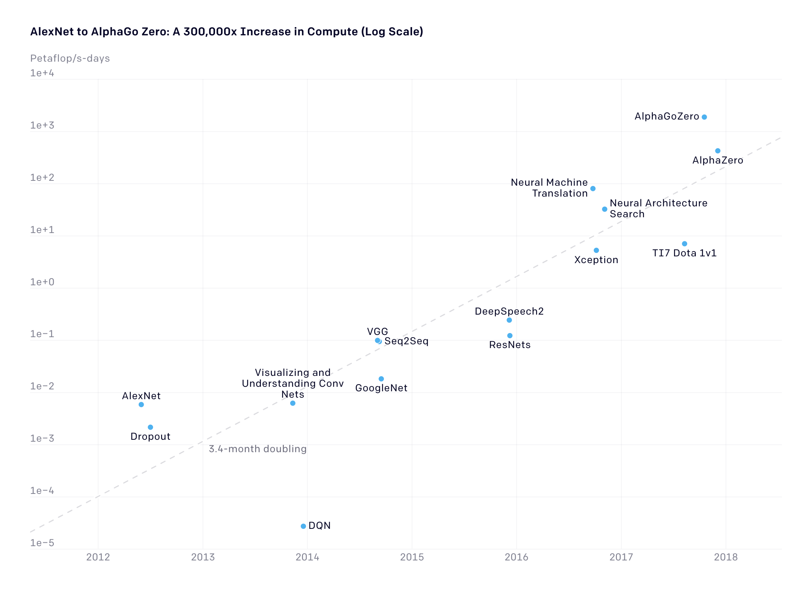

# Parallel Training Techniques
Sam Foreman
[<span class="orcid-green"></span>](https://orcid.org/0000-0002-9981-0876)
2024-03-09

# Parallel Training Techniques

<div>

</div>

# AI 🤝 Compute


<div class="dim-text" style="font-size: 0.55em;">

\[…\] since 2012, the amount of \[AI\] compute used has been increasing
exponentially with a \> 34-month doubling time[^1], or \[**300,000**x\].

</div>

# AI 🤝 Compute \[Modern Era\]



# Single GPU Training


# Collective Communication

Typically, we assign 1 `rank` to each GPU (or `accelerator`),
i.e. `rank` $\in$ `[0, 1, ..., WORLD_SIZE-1]`.

::: {.panel-tabset}

### `AllReduce`

- Perform *reductions* on data (e.g. `sum`, `min`, `max`) across ranks,
  send result back to everyone


### `Reduce`

- Perform a *reduction* on data across ranks, send to individual


### `Broadcast`

- `broadcast` (*send*) a tensor <code>$x$</code> from one rank to all
  ranks


### `AllGather`

- Gathers tensors from the whole group in a list.


### `Scatter`

- Scatters a list of tensors to the whole group


<!-- ### `ReduceScatter` -->
<!---->
<!-- - Reduces, then scatters a list of tensors to all processes in a group. -->
<!---->
<!-- ::: {#fig-reducescatter} -->
<!---->
<!-- {width="50%"} -->
<!---->
<!-- ::: -->
<!---->
<!-- ::: -->

# Collective Operations

> [!WARNING]
>
> ### ⌛ Timeouts
>
> - Collective operations have to be called for each `rank` to form a
>   complete collective operation.
>   - Failure to do so will result in other ranks waiting
>     **indefinitely**

# Why Distributed Training?

- Splitting data across workers $\longrightarrow$ larger batch size[^2]
  - \[`micro_batch_size = 1`\] $\times$ \[`N` GPUs\] $\rightarrow$
    \[<b><code>global_batch_size = N</code></b>\]
- Smooth loss landscape
- Improved gradient estimators
- Less iterations needed for same number of epochs
  - May need to train for more epochs if another change is not made
  - e.g. scaling learning rate
- See [Large Batch Training of Convolutional
  Networks](https://arxiv.org/abs/1708.03888)

# Recent Progress

| Year |  Author  | Batch Size | Processor  |         \# Processors         |               Time                | Accuracy |
|:----:|:--------:|:----------:|:----------:|:-----------------------------:|:---------------------------------:|:--------:|
| 2016 |    He    |    256     | Tesla P100 |               8               |              29 Hour              |  75.30%  |
| 2019 | Yamazaki |   81,920   | Tesla V100 | <span class="red">2048</span> | <span class="blue">1.2 Min</span> |  75.08%  |

<!-- |                                 |             Goyal et al.             |               8192               |                 Tesla P100                  |             Caffe 2             |               1 Hour               |                            76.3%         | -->
<!-- |                                 |             Smith et al.             |         8192 ->  16,384          |                full TPU pod                 |           TensorFlow            |              30 Mins               |                            76.1%         | -->
<!-- |                                 |             Akiba et al.             |              32,768              |              Tesla P100 x1024               |             Chainer             |              15 Mins               |                            74.9%         | -->
<!-- |                                 |              Jia et al.              |              65,536              |              Tesla P40  x2048               |           TensorFLow            |              6.6 Mins              |                            75.8%         | -->
<!-- |                                 |             Ying et al.              |              65,536              |                TPU v3 x1024                 |           TensorFlow            |              1.8 Mins              |                            75.2%         | -->
<!-- |                                 |            Mikami et al.             |              55,296              |              Tesla V100 x3456               |               NNL               |              2.0 Mins              |                           75.29%         | -->

# Data Parallel Training

<!-- ::: {layout="[40,-5, 50]" layout-valign="center" style="display: flex; align-items:flex-end;"} -->
<!---->
<!-- ::: {.col1} -->
<!---->
<!-- ::: -->

<!-- ::: -->

# Data Parallel Training

- 🔗 Links:
  - [PyTorch Distributed
    Overview](https://pytorch.org/tutorials/beginner/dist_overview.html)
  - [Distributed Data Parallel — PyTorch master
    documentation](https://pytorch.org/docs/master/notes/ddp.html)
  - [🤗 Efficient Training on Multiple
    GPUs](https://huggingface.co/docs/transformers/en/perf_train_gpu_many)
  - [Getting Started -
    DeepSpeed](https://www.deepspeed.ai/getting-started/)

# Data Parallel Training


# Data Parallel Training

<div>

</div>

# Data Parallel Training

<div>

</div>

# Data Parallel Training


# Deal with Data

- At each training step, we want to ensure that **each worker receives
  unique data**

- This can be done in one of two ways:

  1.  Manually partition data (ahead of time) and assign different
      sections to different workers
      1.  Each worker can only see their local portion of the data
  2.  From each worker, randomly select a mini-batch
      1.  Each worker can see the full dataset

  > [!WARNING]
  >
  > ### ⚠️ Warning
  >
  > Don’t forget your seed!
  >
  > When randomly selecting, it is important that each worker uses
  > different seeds to ensure they receive unique data

# Best Practices

- Use parallel IO whenever possible
  - Feed each rank from different files
  - Use MPI IO to have each rank read its own batch from a file
  - Use several ranks to read data, MPI to scatter to remaining ranks
    - Most practical in big *at-scale* training

  > [!IMPORTANT]
  >
  > ### Keeping things in Sync 🤝
  >
  > **Computation stalls during communication !!**
  >
  > Keeping the communication to computation ratio small is important
  > for effective scaling.
- Take advantage of data storage
  - Use [striping on
    lustre](https://wiki.lustre.org/Configuring_Lustre_File_Striping)
  - Use the right optimizations for Aurora, Polaris, etc.
- Preload data when possible
  - Offloading to a GPU frees CPU cycles for loading the next batch of
    data
    - **minimize IO latency this way**

# Broadcast Initial State

- At the start of training (or when loading from a checkpoint), we want
  all of our workers to be initialized consistently
  - **Broadcast** the model and optimizer states from `rank() == 0`
    worker


# Model Parallel Training

<div>

</div>

# Hands-On

- [Instructions](https://github.com/argonne-lcf/ai-science-training-series/blob/main/06_parallel_training/README.md)

  -  [`saforem2/wordplay` 🎮💬](https://saforem2.github.io/wordplay/)
    \[[web](https://saforem2.github.io/wordplay/)\]

# Thank you!

- Organizers

- ALCF Data Science & Operations

- Feel free to reach out! <split even >

  [<i class="fas fa-home"></i>](https://samforeman.me)
  [<i class="far fa-paper-plane"></i>](mailto:///foremans@anl.gov)
  [<i class="fab fa-twitter"></i>](https://www.twitter.com/saforem2)
  </split>

<div class="callout-info" icon="false" title="🙏 Acknowledgements">

This research used resources of the Argonne Leadership Computing
Facility, which is a DOE Office of Science User Facility supported under
Contract DE-AC02-06CH11357.

</div>

# Backups

## Forward Pass

- Each worker has identical copy of model[^3]
- **Global batch of data split across workers**
- Loss + Grads averaged across workers before updating parameters


## Organization


# Data Parallel Training

<div>

</div>

## Emergent Abilities

<div width="66%" style="text-align: center;">


[Emergent abilities of Large Language
Models](https://arxiv.org/abs/2206.07682) Yao et al. (2023)

</div>

## Training LLMs

<div>

</div>

## Life-Cycle of the LLM

<div>

</div>

## Forward Pass

<video data-autoplay src="https://huggingface.co/datasets/huggingface/documentation-images/resolve/main/blog/assisted-generation/gif_1_1080p.mov">
</video>

## Generating Text

<video data-autoplay src="https://huggingface.co/datasets/huggingface/documentation-images/resolve/main/blog/assisted-generation/gif_2_1080p.mov">
</video>

## Life-Cycle of the LLM: Pre-training


## Life-Cycle of the LLM: Fine-Tuning


## Assistant Models

<span class="preview-image"
style="text-align:center; margin-left:auto; margin-right: auto;"></span>

## [`saforem2/wordplay` 🎮💬](https://github.com/saforem2/wordplay)

<!-- - [ `saforem2/wordplay`](https://github.com/saforem2/wordplay) -->

- Fork of Andrej Karpathy’s `nanoGPT`


## [`saforem2/wordplay` 🎮💬](https://github.com/saforem2/wordplay)


## Install

``` bash
python3 -m pip install "git+https://github.com/saforem2/wordplay.git"
python3 -c 'import wordplay; print(wordplay.__file__)'
# ./wordplay/src/wordplay/__init__.py
```

## Dependencies

- [`transformers`](https://github.com/huggingface/transformers) for
  transformers (to load `GPT-2` checkpoints)
- [`datasets`](https://github.com/huggingface/datasets) for datasets (if
  you want to use OpenWebText)
- [`tiktoken`](https://github.com/openai/tiktoken) for OpenAI’s fast BPE
  code
- [`wandb`](https://wandb.ai) for optional logging
- [`tqdm`](https://github.com/tqdm/tqdm) for progress bars

## Quick Start

- We start with training a character-level GPT on the works of
  Shakespeare.

  1.  Downloading the data (~ 1MB) file
  2.  Convert raw text to one large stream of integers

  ``` bash
  python3 data/shakespeare_char/prepare.py
  ```

  This will create `data/shakespeare_char/{train.bin, val.bin}`.

## Model [ `model.py`](https://github.com/saforem2/wordplay/blob/master/src/wordplay/model.py)

<div class="panel-tabset" style="height: 100%!important;">

### `CausalSelfAttention`

``` python

class CausalSelfAttention(nn.Module):
    def __init__(self, config: GPTModelConfig):
        super().__init__()
        assert config.n_embd % config.n_head == 0
        # key, query, value projections for all heads, but in a batch
        self.c_attn = nn.Linear(
            config.n_embd,
            3 * config.n_embd,
            bias=config.bias
        )
        # output projection
        self.c_proj = nn.Linear(
            config.n_embd,
            config.n_embd,
            bias=config.bias
        )
        # regularization
        self.attn_dropout = nn.Dropout(config.dropout)
        self.resid_dropout = nn.Dropout(config.dropout)
        self.n_head = config.n_head
        self.n_embd = config.n_embd
        self.dropout = config.dropout
        # flash attention make GPU go brrrrr but support is only in
        # PyTorch >= 2.0
        self.flash = hasattr(
            torch.nn.functional,
            'scaled_dot_product_attention'
        )
        # if self.flash and RANK == 0:
        #     log.warning(
        #         f'Using torch.nn.functional.scaled_dot_product_attention'
        #         '(Flash Attn)'
        #     )
        if not self.flash:
            log.warning(
                "WARNING: using slow attention."
                "Flash Attention requires PyTorch >= 2.0"
            )
            # causal mask to ensure that attention is only applied to the left
            # in the input sequence
            self.register_buffer(
                "bias",
                torch.tril(
                    torch.ones(
                        config.block_size,
                        config.block_size
                    )
                ).view(1, 1, config.block_size, config.block_size)
            )

    def forward(self, x):
        # batch size, sequence length, embedding dimensionality (n_embd)
        B, T, C = x.size()

        # calculate query, key, values for all heads in batch and move head
        # forward to be the batch dim
        q, k, v = self.c_attn(x).split(self.n_embd, dim=2)
        # (B, nh, T, hs)
        k = k.view(B, T, self.n_head, C // self.n_head).transpose(1, 2)
        # (B, nh, T, hs)
        q = q.view(B, T, self.n_head, C // self.n_head).transpose(1, 2)
        # (B, nh, T, hs)
        v = v.view(B, T, self.n_head, C // self.n_head).transpose(1, 2)
        # causal self-attention; Self-attend:
        # (B, nh, T, hs) x (B, nh, hs, T) -> (B, nh, T, T)
        if self.flash:
            # efficient attention using Flash Attention CUDA kernels
            y = torch.nn.functional.scaled_dot_product_attention(
                q,
                k,
                v,
                attn_mask=None,
                dropout_p=(self.dropout if self.training else 0),
                is_causal=True
            )
        else:
            # manual implementation of attention
            att = (q @ k.transpose(-2, -1)) * (1.0 / math.sqrt(k.size(-1)))
            att = att.masked_fill(
                self.bias[:, :, :T, :T] == 0,  # type:ignore
                float('-inf')
            )
            att = F.softmax(att, dim=-1)
            att = self.attn_dropout(att)
            y = att @ v  # (B, nh, T, T) x (B, nh, T, hs) -> (B, nh, T, hs)
        # re-assemble all head outputs side by side
        y = y.transpose(1, 2).contiguous().view(B, T, C)

        # output projection
        y = self.resid_dropout(self.c_proj(y))
        return y
```

### `LayerNorm`

``` python
class LayerNorm(nn.Module):
    """
    LayerNorm but with an optional bias.

    (PyTorch doesn't support simply bias=False)
    """

    def __init__(self, ndim, bias):
        super().__init__()
        self.weight = nn.Parameter(torch.ones(ndim))
        self.bias = nn.Parameter(torch.zeros(ndim)) if bias else None

    def forward(self, input):
        return F.layer_norm(
            input,
            self.weight.shape,
            self.weight,
            self.bias,
            1e-5
        )
```

### `MLP`

``` python
class MLP(nn.Module):

    def __init__(
            self,
            config: GPTModelConfig,
            activation: str = 'gelu',
    ):
        super().__init__()
        self.c_fc = nn.Linear(
            config.n_embd,
            4 * config.n_embd,
            bias=config.bias
        )
        if activation.lower() in ACTIVATIONS:
            self.act_fn = ACTIVATIONS[activation.lower()]
        else:
            try:
                act_fn = getattr(nn, activation)
                assert callable(act_fn)
                self.act_fn = act_fn()
            except Exception as exc:
                log.error(f'{activation} not yet supported!')
                raise exc
        # self.gelu = nn.GELU()
        self.c_proj = nn.Linear(
            4 * config.n_embd,
            config.n_embd,
            bias=config.bias
        )
        self.dropout = nn.Dropout(config.dropout)

    def forward(self, x):
        x = self.c_fc(x)
        # x = self.gelu(x)
        x = self.act_fn(x)
        x = self.c_proj(x)
        x = self.dropout(x)
        return x
```

### `Block`

``` python
class Block(nn.Module):

    def __init__(self, config: GPTModelConfig):
        super().__init__()
        self.ln_1 = LayerNorm(config.n_embd, bias=config.bias)
        self.attn = CausalSelfAttention(config)
        self.ln_2 = LayerNorm(config.n_embd, bias=config.bias)
        self.mlp = MLP(config)

    def forward(self, x):
        x = x + self.attn(self.ln_1(x))
        x = x + self.mlp(self.ln_2(x))
        return x
```

### `GPT`

``` python
class GPT(nn.Module):
    def __init__(self, config: GPTModelConfig):
        super().__init__()
        assert config.vocab_size is not None
        assert config.block_size is not None
        self.config = config

        self.transformer = nn.ModuleDict(dict(
            wte=nn.Embedding(config.vocab_size, config.n_embd),
            wpe=nn.Embedding(config.block_size, config.n_embd),
            drop=nn.Dropout(config.dropout),
            h=nn.ModuleList([Block(config) for _ in range(config.n_layer)]),
            ln_f=LayerNorm(config.n_embd, bias=config.bias),
        ))
        self.lm_head = nn.Linear(config.n_embd, config.vocab_size, bias=False)
        # with weight tying when using torch.compile() some warnings get
        # generated: "UserWarning: functional_call was passed multiple values
        # for tied weights. This behavior is deprecated and will be an error in
        # future versions" not 100% sure what this is, so far seems to be
        # harmless. TODO investigate
        # https://paperswithcode.com/method/weight-tying
        self.transformer.wte.weight = self.lm_head.weight  # type:ignore

        # init all weights
        self.apply(self._init_weights)
        # apply special scaled init to the residual projections, per GPT-2
        for pn, p in self.named_parameters():
            if pn.endswith('c_proj.weight'):
                torch.nn.init.normal_(
                    p,
                    mean=0.0,
                    std=0.02/math.sqrt(2 * config.n_layer)
                )

        # report number of parameters
        log.info("number of parameters: %.2fM" % (self.get_num_params()/1e6,))

    def get_num_params(self, non_embedding=True):
        """
        Return the number of parameters in the model.
        For non-embedding count (default), the position embeddings get
        subtracted.

        The token embeddings would too, except due to the parameter sharing
        these params are actually used as weights in the final layer, so we
        include them.
        """
        n_params = sum(p.numel() for p in self.parameters())
        if non_embedding:
            n_params -= self.transformer.wpe.weight.numel()  # type:ignore
        return n_params

    def _init_weights(self, module):
        if isinstance(module, nn.Linear):
            torch.nn.init.normal_(module.weight, mean=0.0, std=0.02)
            if module.bias is not None:
                torch.nn.init.zeros_(module.bias)
        elif isinstance(module, nn.Embedding):
            torch.nn.init.normal_(module.weight, mean=0.0, std=0.02)

    def forward(self, idx, targets=None):
        device = idx.device
        b, t = idx.size()
        assert t <= self.config.block_size, (
            f"Cannot forward sequence of length {t}, "
            "block size is only {self.config.block_size}"
        )
        pos = torch.arange(
            0,
            t,
            dtype=torch.long,
            device=device
        )  # shape (t)

        # forward the GPT model itself
        # token embeddings of shape (b, t, n_embd)
        tok_emb = self.transformer.wte(idx)  # type:ignore
        # position embeddings of shape (t, n_embd)
        pos_emb = self.transformer.wpe(pos)  # type:ignore
        x = self.transformer.drop(tok_emb + pos_emb)  # type:ignore
        for block in self.transformer.h:  # type:ignore
            x = block(x)
        x = self.transformer.ln_f(x)  # type:ignore
        if targets is not None:
            # if we are given some desired targets also calculate the loss
            logits = self.lm_head(x)
            loss = F.cross_entropy(
                logits.view(
                    -1,
                    logits.size(-1)
                ),
                targets.view(-1),
                ignore_index=-1
            )
        else:
            # inference-time mini-optimization: only forward the lm_head on the
            # very last position
            # note: using list [-1] to preserve the time dim
            logits = self.lm_head(x[:, [-1], :])
            loss = None

        return logits, loss

    def crop_block_size(self, block_size):
        # model surgery to decrease the block size if necessary e.g. we may
        # load the GPT2 pretrained model checkpoint (block size 1024) but want
        # to use a smaller block size for some smaller, simpler model
        assert block_size <= self.config.block_size
        self.config.block_size = block_size
        self.transformer.wpe.weight = (  # type:ignore
            nn.Parameter(
                self.transformer.wpe.weight[:block_size]  # type:ignore
            )
        )
        for block in self.transformer.h:   # type:ignore
            if hasattr(block.attn, 'bias'):
                block.attn.bias = (
                    block.attn.bias[:, :, :block_size, :block_size]
                )

    @classmethod
    def from_pretrained(cls, model_type, override_args=None):
        assert model_type in {'gpt2', 'gpt2-medium', 'gpt2-large', 'gpt2-xl'}
        override_args = override_args or {}  # default to empty dict
        # only dropout can be overridden see more notes below
        assert all(k == 'dropout' for k in override_args)
        from transformers import GPT2LMHeadModel
        log.info(f"loading weights from pretrained gpt: {model_type=}")
        # n_layer, n_head and n_embd are determined from model_type
        # gpt2: 124M params
        # gpt2-medium: 350M params
        # gpt2-large: 774M params
        # gpt2-xl: 1558M params
        config_args = {
            # 'baby-llama2': dict(n_layer=16, n_head=16, n_embed=1024),
            # 'llama2-7b': dict(n_layer=32, n_head=32, n_embd=4096),
            'gpt2': dict(n_layer=12, n_head=12, n_embd=768),
            'gpt2-medium': dict(n_layer=24, n_head=16, n_embd=1024),
            'gpt2-large': dict(n_layer=36, n_head=20, n_embd=1280),
            'gpt2-xl': dict(n_layer=48, n_head=25, n_embd=1600),
        }[model_type]
        # we can override the dropout rate, if desired
        if 'dropout' in override_args:
            log.info(f"overriding dropout rate to {override_args['dropout']}")
            config_args['dropout'] = override_args['dropout']
        # create a from-scratch initialized minGPT model
        log.info("forcing vocab_size=50257, block_size=1024, bias=True")
        config = GPTModelConfig(
            **config_args,
            block_size=1024,   # always 1024 for GPT model checkpoints
            vocab_size=50257,  # always 50257 for GPT model checkpoints
            bias=True,         # always True for GPT model checkpoints
        )
        model = GPT(config)
        sd = model.state_dict()
        sd_keys = sd.keys()
        sd_keys = [
            k for k in sd_keys if not k.endswith('.attn.bias')
        ]  # discard this mask / buffer, not a param

        # init a huggingface/transformers model
        model_hf = GPT2LMHeadModel.from_pretrained(model_type)
        sd_hf = model_hf.state_dict()

        # copy while ensuring all of the parameters are aligned and match in
        # names and shapes
        sd_keys_hf = sd_hf.keys()
        sd_keys_hf = [
            k for k in sd_keys_hf if not k.endswith('.attn.masked_bias')
        ]  # ignore these, just a buffer
        sd_keys_hf = [
            k for k in sd_keys_hf if not k.endswith('.attn.bias')
        ]  # same, just the mask (buffer)
        transposed = [
            'attn.c_attn.weight',
            'attn.c_proj.weight',
            'mlp.c_fc.weight',
            'mlp.c_proj.weight'
        ]
        # basically the openai checkpoints use a "Conv1D" module, but we only
        # want to use a vanilla Linear this means that we have to transpose
        # these weights when we import them
        assert len(sd_keys_hf) == len(sd_keys), (
            f"mismatched keys: {len(sd_keys_hf)} != {len(sd_keys)}"
        )
        for k in sd_keys_hf:
            if any(k.endswith(w) for w in transposed):
                # special treatment for the Conv1D weights we need to transpose
                assert sd_hf[k].shape[::-1] == sd[k].shape
                with torch.no_grad():
                    sd[k].copy_(sd_hf[k].t())
            else:
                # vanilla copy over the other parameters
                assert sd_hf[k].shape == sd[k].shape
                with torch.no_grad():
                    sd[k].copy_(sd_hf[k])

        return model

    def configure_optimizers(
            self,
            weight_decay,
            learning_rate,
            betas,
            device_type
    ):
        # start with all of the candidate parameters
        # filter out those that do not require grad
        # param_dict = {
        #     pn: p for pn, p in param_dict.items() if p.requires_grad
        # }
        param_dict = {
            pn: p for pn, p in self.named_parameters() if p.requires_grad
        }
        # create optim groups. Any parameters that is 2D will be weight
        # decayed, otherwise no. i.e. all weight tensors in matmuls +
        # embeddings decay, all biases and layernorms don't.
        decay_params = [p for _, p in param_dict.items() if p.dim() >= 2]
        nodecay_params = [p for _, p in param_dict.items() if p.dim() < 2]
        optim_groups = [
            {'params': decay_params, 'weight_decay': weight_decay},
            {'params': nodecay_params, 'weight_decay': 0.0}
        ]
        num_decay_params = sum(p.numel() for p in decay_params)
        num_nodecay_params = sum(p.numel() for p in nodecay_params)
        log.info(
            f"num decayed parameter tensors: {len(decay_params)}, "
            f"with {num_decay_params:,} parameters"
        )
        log.info(
            f"num non-decayed parameter tensors: {len(nodecay_params)}, "
            f"with {num_nodecay_params:,} parameters"
        )
        # Create AdamW optimizer and use the fused version if it is available
        fused_available = (
            'fused' in inspect.signature(torch.optim.AdamW).parameters
        )
        use_fused = fused_available and device_type == 'cuda'
        extra_args = dict(fused=True) if use_fused else {}
        optimizer = torch.optim.AdamW(
            optim_groups,
            lr=learning_rate,
            betas=betas,
            **extra_args
        )
        log.info(f"using fused AdamW: {use_fused}")

        return optimizer

    def estimate_mfu(self, fwdbwd_per_iter, dt):
        """Estimate model flops utilization (MFU)

        (in units of A100 bfloat16 peak FLOPS)
        """
        # first estimate the number of flops we do per iteration.
        # see PaLM paper Appendix B as ref: https://arxiv.org/abs/2204.02311
        N = self.get_num_params()
        cfg = self.config
        L, H, Q, T = (
            cfg.n_layer,
            cfg.n_head,
            cfg.n_embd//cfg.n_head,
            cfg.block_size
        )
        flops_per_token = 6*N + 12*L*H*Q*T
        flops_per_fwdbwd = flops_per_token * T
        flops_per_iter = flops_per_fwdbwd * fwdbwd_per_iter
        # express our flops throughput as ratio of A100 bfloat16 peak flops
        flops_achieved = flops_per_iter * (1.0/dt)  # per second
        flops_promised = 312e12  # A100 GPU bfloat16 peak flops is 312 TFLOPS
        return flops_achieved / flops_promised

    @torch.no_grad()
    def generate(self, idx, max_new_tokens, temperature=1.0, top_k=None):
        """
        Take a conditioning sequence of indices idx (LongTensor of shape (b,t))
        and complete the sequence max_new_tokens times, feeding the predictions
        back into the model each time.

        Most likely you'll want to make sure to be in model.eval() mode of
        operation for this.
        """
        for _ in range(max_new_tokens):
            # if the sequence context is growing too long we must crop it at
            # block_size
            idx_cond = (
                idx if idx.size(1) <= self.config.block_size
                else idx[:, -self.config.block_size:]
            )
            # forward the model to get the logits for the index in the sequence
            logits, _ = self(idx_cond)
            # pluck the logits at the final step and scale by desired
            # temperature
            logits = logits[:, -1, :] / temperature
            # optionally crop the logits to only the top k options
            if top_k is not None:
                v, _ = torch.topk(logits, min(top_k, logits.size(-1)))
                logits[logits < v[:, [-1]]] = -float('Inf')
            # apply softmax to convert logits to (normalized) probabilities
            probs = F.softmax(logits, dim=-1)
            # sample from the distribution
            idx_next = torch.multinomial(probs, num_samples=1)
            # append sampled index to the running sequence and continue
            idx = torch.cat((idx, idx_next), dim=1)

        return idx
```

</div>

## Trainer [ `trainer.py`](https://github.com/saforem2/wordplay/blob/master/src/wordplay/trainer.py)

<div class="panel-tabset"
style="font-size: 0.75em; width: 100%; height: 100%;">

### `get_batch`

``` python
            engine, optimizer, *_ = deepspeed.initialize(
                model=model,
                config=ds_config,
                model_parameters=model.parameters()
            )
        else:
            raise ValueError('Unable to initialize DeepSpeed')
        assert engine is not None and optimizer is not None
        return {
            'model_engine': engine,
            'optimizer': optimizer,
            'ds_config': ds_config,
        }

    def get_batch(self, split: str) -> tuple[torch.Tensor, torch.Tensor]:
        # data = self.config.train_data if split == 'train'
        # else self.config.val_data
        data = self.config.data.data.get(split, None)
        assert data is not None
        ix = torch.randint(
            len(data) - self.config.model.block_size,
            (self.config.model.batch_size,)
        )
        block_size = self.config.model.block_size
        x = torch.stack(
            [
                torch.from_numpy((data[i:i+block_size]).astype(np.int64))
                for i in ix
            ]
```

### `_forward_step`

``` python
            n_embd=ckpt_model['n_embd'],
            block_size=ckpt_model['block_size'],
            bias=ckpt_model['bias'],
            vocab_size=ckpt_model['vocab_size'],
        )
        model = GPT(model_config)
        state_dict = checkpoint['model']
        unwanted_prefix = '_orig_mod.'
        for k, _ in list(state_dict.items()):
```

### `_backward_step`

``` python
                state_dict[k[len(unwanted_prefix):]] = state_dict.pop(k)
        model.load_state_dict(state_dict)
        return model, checkpoint

    def _forward_step(self, x: torch.Tensor, y: torch.Tensor) -> dict:
        t0 = time.perf_counter()
        with self.config.ctx:
            logits, loss = self.model_engine(x, y)
        return {
            'logits': logits,
            'loss': loss,
            'dt': time.perf_counter() - t0
        }

    def _backward_step(
            self,
            loss: torch.Tensor,
            propagate_grads: bool = False,
    ) -> float:
        t0 = time.perf_counter()
        if self.config.train.backend.lower() in ['ds', 'deepspeed']:
            self.model_engine.backward(loss)  # type:ignore
            self.model_engine.step(loss)      # type:ignore
        else:
            if self.grad_scaler is not None:
                self.grad_scaler.scale(loss).backward()  # type:ignore
```

### `train_step`

``` python
                if self.config.optimizer.grad_clip != 0.0:
                    if self.grad_scaler is not None:
                        self.grad_scaler.unscale_(self.optimizer)
                    torch.nn.utils.clip_grad_norm_(  # pyright: ignore
                        self.model_engine.parameters(),
                        self.config.optimizer.grad_clip
                    )
                if self.grad_scaler is not None:
                    self.grad_scaler.step(self.optimizer)
                    self.grad_scaler.update()
                    self.optimizer.zero_grad(set_to_none=True)

        return time.perf_counter() - t0

    def train_step(
            self,
            x: torch.Tensor,
            y: torch.Tensor,
    ) -> dict:
        lr = (
            self.get_lr(self.config.iter_num)
            if self.config.optimizer.decay_lr
            else self._lr
        )
        for param_group in self.optimizer.param_groups:
            param_group['lr'] = lr
        dtf = []
        dtb = []
        dt = []
        loss = torch.tensor(0.0)
        for micro_step in range(self._gas):
            is_last_micro_step = (micro_step == self._gas - 1)
            # NOTE: -----------------------------------------------------------
            # In DDP training we only need to sync gradients at the last micro
            # step. the official way to do this is with model.no_sync() context
            # manager, but I really dislike that this bloats the code and
            # forces us to repeat code looking at the source of that context
            # manager, it just toggles this variable
            # -----------------------------------------------------------------
            if self.config.train.backend.lower() == 'ddp':
                _ = (
                    self.model_engine.require_backward_grad_sync
                    if (is_last_micro_step and self.world_size > 1)
                    else None
                )
            fout = self._forward_step(x, y)
            # immediately async prefetch next batch while model is doing the
            # forward pass on the GPU
            x, y = self.get_batch('train')
            loss = fout['loss'] / self._gas
            dtf.append(fout['dt'])
            dtb_ = self._backward_step(
                loss,
                propagate_grads=is_last_micro_step
            )
            dtb.append(dtb_)
            dt.append(dtf + dtb)
        timers = {
            'iter': self.config.iter_num,
            'dt': np.array(dt),
            'dt_tot': np.sum(dt),
            'dt_avg': np.mean(dt),
            'dtf': np.array(dtf),
            'dtf_tot': np.sum(dtf),
            'dtf_avg': np.mean(dtf),
            'dtb': np.array(dtb),
            'dtb_tot': np.sum(dtb),
            'dtb_avg': np.mean(dtb)
        }
        metrics = {
            'iter': self.config.iter_num,
            'loss': loss,
            'lr': lr,
        }
        self.config.iter_num += 1
        return {
            'metrics': metrics,
            'timers': timers,
            'x': x,
            'y': y,
        }

    def save_ckpt(
            self,
            raw_model: Optional[torch.nn.Module | GPT] = None,
            add_to_wandb: bool = False
    ):
        if raw_model is not None:
            model = raw_model  # type:ignore
        else:
            model = self.model
        assert model is not None
        assert isinstance(model, torch.nn.Module)
        # assert issubclass(GPT,  torch.nn.Module)
        ckpt = {
            'model': model.state_dict(),
            'optimizer': self.optimizer.state_dict(),
            'model_args': asdict(self.config.model),
            'iter_num': self.config.iter_num,
            'best_val_loss': self.config.best_val_loss,
            'config': asdict(self.config),
        }
        # assert (
        #     isinstance(model, GPT)
```

### `estimate_loss`

``` python
            y = y.to(self.config.device_type)
        return x, y

    def get_lr(self, it: int) -> float:
        if it < self._witers:
            return self._lr * it / self._witers
        if it > self._diters:
            return self._min_lr
        decay_ratio = (it - self._witers) / (self._diters - self._witers)
        assert 0 <= decay_ratio <= 1
        coeff = 0.5 * (1.0 + math.cos(math.pi * decay_ratio))
        return self._min_lr + coeff * (self._lr - self._min_lr)

    @torch.no_grad()
```

</div>

## Hands-on Tutorial

<div>

</div>

## 

## Links

1.  [
    Hannibal046/Awesome-LLM](https://github.com/Hannibal046/Awesome-LLM/blob/main/README.md)
    <span class="inline-image">[](https://awesome.re)</span>
2.  [
    Mooler0410/LLMsPracticalGuide](https://github.com/Mooler0410/LLMsPracticalGuide)
3.  [Large Language Models (in
    2023)](https://docs.google.com/presentation/d/1636wKStYdT_yRPbJNrf8MLKpQghuWGDmyHinHhAKeXY/edit#slide=id.g238b2698243_0_734https://docs.google.com/presentation/d/1636wKStYdT_yRPbJNrf8MLKpQghuWGDmyHinHhAKeXY/edit#slide=id.g238b2698243_0_734)
4.  [The Illustrated
    Transformer](http://jalammar.github.io/illustrated-transformer/)
5.  [Generative AI Exists because of the
    Transformer](https://ig.ft.com/generative-ai/)
6.  [GPT in 60 Lines of
    Numpy](https://jaykmody.com/blog/gpt-from-scratch/)
7.  [Better Language Models and their
    Implications](https://openai.com/research/better-language-models)  
8.  <span class="green-text"></span> [Progress / Artefacts / Outcomes
    from 🌸 Bloom
    BigScience](https://bigscience.notion.site/ebe3760ae1724dcc92f2e6877de0938f?v=2faf85dc00794321be14bc892539dd4f)

> [!NOTE]
>
> ### Acknowledgements
>
> This research used resources of the Argonne Leadership Computing
> Facility,  
> which is a DOE Office of Science User Facility supported under
> Contract DE-AC02-06CH11357.

## References

1.  [NVIDIA / NCCL / Collective
    Operations](https://docs.nvidia.com/deeplearning/nccl/user-guide/docs/usage/collectives.html)

<div id="refs" class="references csl-bib-body hanging-indent"
entry-spacing="0">

<div id="ref-yao2023tree" class="csl-entry">

Yao, Shunyu, Dian Yu, Jeffrey Zhao, Izhak Shafran, Thomas L. Griffiths,
Yuan Cao, and Karthik Narasimhan. 2023. “Tree of Thoughts: Deliberate
Problem Solving with Large Language Models.”
<https://arxiv.org/abs/2305.10601>.

</div>

</div>

[^1]: By comparison, Moore’s Law had a 2-year doubling period, and would
    have doubled 7x since 2012

[^2]: `micro_batch_size` = batch_size **per** GPU

[^3]: Test
